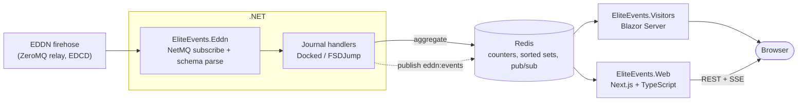

# Elite Dangerous Visitor Analytics

**A real-time data pipeline and dashboards for the [Elite Dangerous Data Network](https://eddn.edcd.io/) (EDDN).**

EliteEvents listens to the live EDDN firehose — the community data stream that *Elite Dangerous* players opt into — aggregates the events into Redis, and surfaces them through two web front ends. EDDN itself keeps no history (it's a pure relay), so the interesting work is turning that ephemeral stream into queryable galactic activity: which star systems are busiest this week, where commanders are docking, and a live feed of events as they happen.

It's a polyglot system by design — C# for high-throughput ingestion, Redis as the shared state layer, and both .NET and Node/React front ends reading the same data — deployed with Docker and Caddy on a DigitalOcean droplet via GitHub Actions.

## Overview

This web application provides insights into station and fleet carrier traffic patterns by analyzing docking data from the Elite Dangerous Data Network (EDDN). Commanders can search for star systems or fleet carriers to view visitor statistics and activity trends.

## Architecture

The ingestion side connects to the EDDN ZeroMQ relay, decompresses each frame (zlib), and parses it against the published EDDN schemas into strongly-typed messages. A background service dispatches journal events to handlers; the `Docked` and `FSDJump` handlers aggregate activity into Redis. Both front ends read those aggregates — and for live updates, the handlers publish each event to a Redis pub/sub channel that the Next.js app relays to the browser over Server-Sent Events.

## Projects

- **[`EliteEvents.Eddn`](./EliteEvents.Eddn)** — a reusable .NET library: the NetMQ EDDN subscriber, schema-generated message types, and a DI-friendly handler-dispatch pipeline. No knowledge of storage or UI; just turns the firehose into typed events you can subscribe to.
- **[`EliteEvents.Visitors`](./EliteEvents.Visitors)** — a Blazor Server app that hosts the ingestion background service and renders the leaderboards, per-system detail, and fleet-carrier views with an Elite-styled UI.
- **[`EliteEvents.Web`](./EliteEvents.Web)** — a Next.js + TypeScript dashboard reading the same Redis: a most-visited-systems leaderboard (auto-refreshing client component), per-system docking detail (server component), and an SSE live feed. See its [README](./EliteEvents.Web/README.md).

### Features

- **System Search** - View docking statistics for all stations within a star system
- **Fleet Carrier Search** - Track day-by-day visitor counts for individual fleet carriers
- **Real-time Data** - Live updates via EDDN data feed
- **Automatic Data Retention** - 30-day rolling window with automatic purging of inactive entries

## Data model (Redis)

| Key | Type | Meaning |
|-----|------|---------|
| `systems:visits` | sorted set | system → visit count (weekly leaderboard) |
| `system:{SYSTEM}:stations` | sorted set | station → last-seen timestamp |
| `system:{SYSTEM}:station:{station}` | hash | `{ count, type, last_seen }` per station |
| `carrier:{ID}:days` | sorted set | active day → timestamp |
| `carrier:{ID}:daily:{date}` | counter | dockings for that carrier on that day |
| `eddn:events` | pub/sub channel | live event stream consumed by the SSE feed |

Station and fleet-carrier keys carry a 30-day TTL; the systems leaderboard resets weekly on a Thursday-aligned schedule, mirroring the in-game cycle.

## Technology Stack

### Backend
- **ASP.NET Core Blazor Server** - Web framework
- **Redis** - Data storage and caching
- **ZeroMQ** - Message bus for EDDN data ingestion

### Frontend
- **Bootstrap 5** - CSS framework
- **Bootstrap Icons** - Icon library
- **Elite Dangerous Assets** - Custom fonts and imagery

## Data Source

Data is sourced from the [Elite Dangerous Data Network (EDDN)](https://github.com/EDCD/EDDN), a real-time feed of player-submitted journal data. Visit [EDDN Realtime](https://eddn-realtime.space/) to learn more about the network.

## Credits

### UI Framework
- [Bootstrap 5](https://getbootstrap.com/) - CSS Framework
- [Elite Dangerous Assets](https://edassets.org/) - Fonts and Images

### External Resources
- [Inara](https://inara.cz/) - Elite Dangerous Database & Community
- [Elite Dangerous Data Network (EDDN)](https://github.com/EDCD/EDDN) - Realtime Data Feed

EDDN is community-run and **not affiliated with Frontier Developments**; its data is contributed by players using EDDN-enabled tools. Thanks to the [EDCD](https://github.com/EDCD) community for hosting and maintaining the network.

## License

© 2026 [Tony Rasa](https://www.linkedin.com/in/tonyrasa/)

Not run by or affiliated in any way with [Frontier Developments plc](http://www.frontier.co.uk/)

---

*Elite Dangerous is a registered trademark of Frontier Developments plc.*
