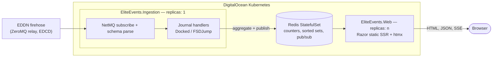

# Elite Dangerous Visitor Analytics

**A real-time data pipeline and dashboard for the [Elite Dangerous Data Network](https://eddn.edcd.io/) (EDDN).**

EliteEvents listens to the live EDDN firehose — the community data stream that *Elite Dangerous* players opt into — aggregates the events into Redis, and surfaces them at **[elite.meancat.com](https://elite.meancat.com)**. EDDN itself keeps no history (it's a pure relay), so the interesting work is turning that ephemeral stream into queryable galactic activity: which star systems are busiest this week, where commanders are docking, and a live feed of events as they happen.

Ingestion and serving are separate containers on DigitalOcean Kubernetes: a single-writer EDDN subscriber, and a stateless web tier that scales independently.

## Overview

The site provides insight into station and fleet-carrier traffic patterns by aggregating docking data from EDDN. Commanders can search for star systems or fleet carriers to view visitor statistics and activity trends, or watch events arrive live.

## Architecture

```mermaid
flowchart LR
    EDDN["EDDN firehose<br/>(ZeroMQ relay, EDCD)"] --> Ingest

    subgraph K8S["DigitalOcean Kubernetes"]
      subgraph W1["EliteEvents.Ingestion — replicas: 1"]
        Ingest["NetMQ subscribe + schema parse"] --> Handlers["Journal handlers<br/>Docked / FSDJump"]
      end
      Handlers -->|aggregate + publish| Redis[("Redis StatefulSet<br/>counters, sorted sets, pub/sub")]
      Redis --> Web["EliteEvents.Web — replicas: n<br/>Razor static SSR + htmx"]
    end

    Web -->|HTML, JSON, SSE| Browser(["Browser"])
```

The ingestion side connects to the EDDN ZeroMQ relay, decompresses each frame (zlib), and parses it against the published EDDN schemas into strongly-typed messages. A background service dispatches journal events to handlers; the `Docked` and `FSDJump` handlers aggregate activity into Redis and publish each event to a pub/sub channel.

The web tier renders server-side with no Blazor circuit — every interaction is an htmx `hx-get` against a fragment endpoint, and the live ticker is Server-Sent Events, with one Redis subscription per pod fanned out to its connected browsers. Nothing is held in a session, so any pod can serve any request.

## Projects

- **[`EliteEvents.Eddn`](./EliteEvents.Eddn)** — a reusable .NET library: the NetMQ EDDN subscriber, schema-generated message types, a DI-friendly handler-dispatch pipeline, and the Redis storage layer. Reader and writer are separate interfaces, so a host only gets the half it needs.
- **[`EliteEvents.Ingestion`](./EliteEvents.Ingestion)** — the EDDN writer. A minimal ASP.NET host exposing only `/health/live` and `/health/ready`; runs as a single replica so events are never double-counted.
- **[`EliteEvents.Web`](./EliteEvents.Web)** — the public site: leaderboards, per-system and per-carrier detail, search, a JSON API, and an SSE live feed. Razor Components in static SSR plus htmx, styled with the Elite theme.
- **[`EliteEvents.JournalWeb`](./EliteEvents.JournalWeb)** — a legacy app that reads local journal files. Not deployed.

### Features

- **System Search** — docking statistics for every station in a star system
- **Fleet Carrier Search** — day-by-day visitor counts for individual carriers
- **Live Feed** — events streamed from EDDN to the browser as they arrive
- **Automatic Data Retention** — 30-day rolling window, inactive entries expire themselves

## Data model (Redis)

| Key | Type | Meaning |
|-----|------|---------|
| `systems:visits` | sorted set | system → visit count (weekly leaderboard) |
| `system:{SYSTEM}:stations` | sorted set | station → last-seen timestamp |
| `system:{SYSTEM}:station:{station}` | hash | `{ count, type, last_seen }` per station |
| `carrier:{ID}:days` | sorted set | active day → timestamp |
| `carrier:{ID}:daily:{date}` | counter | dockings for that carrier on that day |
| `heartbeat:eddn` | string | last EDDN message time, so the web tier can see ingestion liveness |
| `eddn:events` | pub/sub channel | live event stream consumed by the SSE feed |

Station and fleet-carrier keys carry a 30-day TTL; the systems leaderboard resets weekly on a Thursday-aligned schedule, mirroring the in-game cycle. Every key is disposable by design — the store can be thrown away and refilled from the firehose, which is why Redis runs in-cluster rather than as a managed database.

## Technology Stack

- **ASP.NET Core Razor Components (static SSR)** + **htmx** — server-rendered UI with no client framework
- **Redis** — aggregation, cache and pub/sub
- **ZeroMQ (NetMQ)** — EDDN ingestion
- **Kubernetes on DigitalOcean** — ingress-nginx, cert-manager, DOCR; manifests in [`k8s/`](./k8s)
- **Bootstrap 5** and **[Elite Dangerous Assets](https://edassets.org/)** — theme, fonts, imagery

## Data Source

Data is sourced from the [Elite Dangerous Data Network (EDDN)](https://github.com/EDCD/EDDN), a real-time feed of player-submitted journal data. Visit [EDDN Realtime](https://eddn-realtime.space/) to learn more about the network.

## Credits

### UI Framework
- [Bootstrap 5](https://getbootstrap.com/) - CSS Framework
- [htmx](https://htmx.org/) - Hypermedia interactions
- [Elite Dangerous Assets](https://edassets.org/) - Fonts and Images

### External Resources
- [Inara](https://inara.cz/) - Elite Dangerous Database & Community
- [Elite Dangerous Data Network (EDDN)](https://github.com/EDCD/EDDN) - Realtime Data Feed

EDDN is community-run and **not affiliated with Frontier Developments**; its data is contributed by players using EDDN-enabled tools. Thanks to the [EDCD](https://github.com/EDCD) community for hosting and maintaining the network.

## License

© 2026 [Tony Rasa](https://www.linkedin.com/in/tonyrasa/)

Not run by or affiliated in any way with [Frontier Developments plc](http://www.frontier.co.uk/)

---

*Elite Dangerous is a registered trademark of Frontier Developments plc.*
